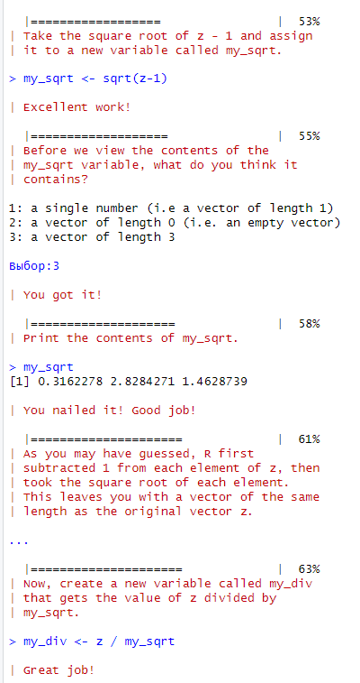
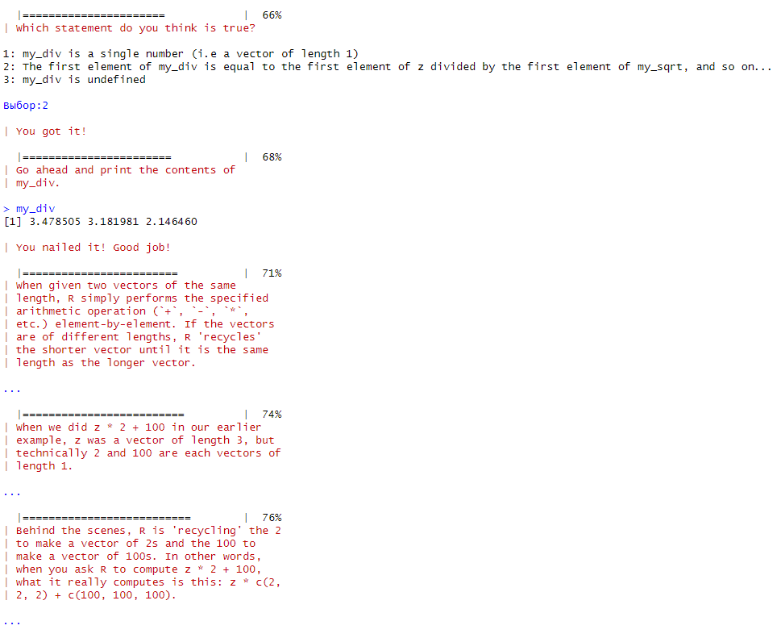
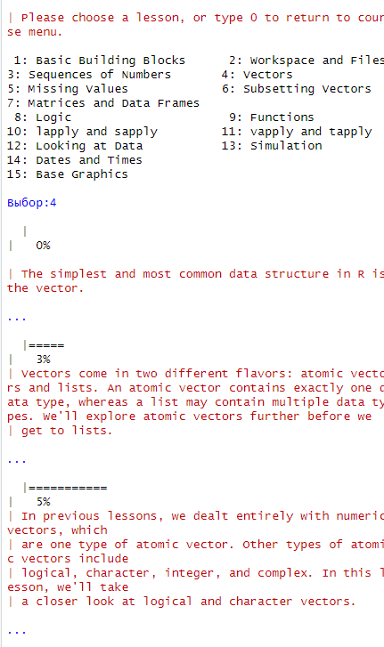

# Практическая работа 1

## Цель работы

1.  Познакомиться с языком R посредством библиотеки swirl.

## Исходные данные

1.  Rstudio.

## План

1.  Установить библиотеку swirl.

2.  Пройти 4 учебных задания.

3.  Оформить отчет.

## Описание шагов

1.  Запускаем библиотеку.

``` r
library(swirl)
```

    Warning: пакет 'swirl' был собран под R версии 4.3.2


    | Hi! I see that you have some variables saved in your workspace. To keep
    | things running smoothly, I recommend you clean up before starting swirl.

    | Type ls() to see a list of the variables in your workspace. Then, type
    | rm(list=ls()) to clear your workspace.

    | Type swirl() when you are ready to begin.

1.  Начинаем выполнение перовго учебного задания Basic Building Blocks.







1.  Выполяем второе учебное задание Workspace and Files.


1.  Выполняем третье учебное задание Sequences of Numbers.


1.  Выполняем четвертое учебное задание Vectors.




## Вывод

В данное практической работе я познакомился с основами языка R. Таким
образом, я приобрел базовые новыки для работы с языком R.
