## Цель работы
1. Развить практические навыки использования языка программирования R для обработки данных.
2. Закрепить знания базовых типов данных языка R.
3. Развить пркатические навыки использования функций обработки данных пакета dplyr – функции
select(), filter(), mutate(), arrange(), group_by().

## Исходные данные
1. RStudio.

## План
1. Познакомиться с базовыми типами данных в языке R.
2. Выполнить задания.
3. Оформить отчет.

## Описание шагов
1. Установливаем библиотеку dplyr

```
library(dplyr)
```
2. Загружаем пакет dplyr и загружаем датафрейм starwars

```
library(dplyr)
data(starwars)
```
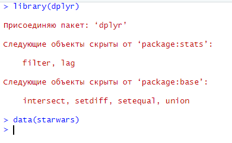
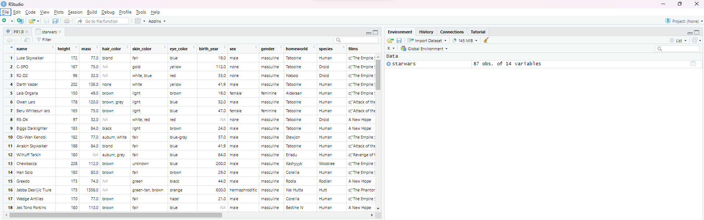

3. Переходим к выполнению заданий

- Задание 1. Сколько строк в датафрейме?

```
n_rows <- starwars %>% nrow()
print(n_rows)
```
Присваиваем переменной n_rows кол-во строк в датафрейме, 
%>% - используется для передачи данных из одной функции в другую,
вызываем функцию nrow(), которая возвращает кол-во строк в датафрейме,
выводим результат на экран.

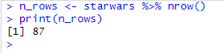

- Задание 2. Сколько столбцов в датафрейме?

```
n_columns <- starwars %>% ncol()
print(n_columns)
```
Присваиваем переменной n_columns кол-во столбцов в датафрейме, вызываем функцию ncol(), которая возвращает кол-во
столбцов в датафрейме, выводим результат на экран.


- Задание 3. Как просмотреть примерный вид датафрейма?

```
dataframe <- starwars %>% glimpse()
print(dataframe)
```
Присваиваем переменной dataframe результат работы функции glimpse(), которая показывает краткую информацию о стрктуре датафрейма(кол-во строк, столбцов и типов данных в каждом столбце), выводим результат на экран.

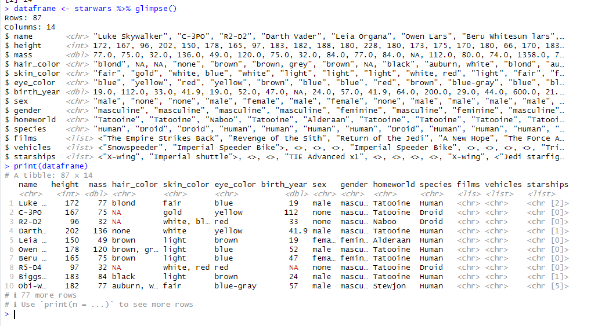


- Задание 4. Сколько уникальных рас персонажей (species) представлено в данных?

```
unique_species <- starwars %>%
  select(species) %>%
  distinct() %>%
  nrow()
print(unique_species)
```
Присваиваем переменной unique_species результат работы функций: select(species) - выбираем столбец с расами, distinct() - удаляем повторяющиеся строки в выбранном столбце, оставляя только уникальные значения, nrow() - считаем кол-во строк в итоге и вывовим результат на экран.

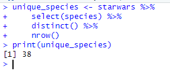

- Задание 5. Найти самого высокого персонажа.

```
tallest_hero <- starwars %>%
  filter(height == max(height, na.rm = TRUE))
print(tallest_hero)
```
Присваиваем переменной tallest_hero результат работы функций: filter(height == max(height, na.rm = TRUE)) - фильтруем датафрейм, оставляя только те строки, где значение в столбце height равно максимальному значению в столбце так же мы игнорируем отсутствующие значения(потому что если мы не укажем этого то если в столбце отсутствует хотя бы одно значение(NA), то функция max() вернет нам NA) и выводим резултат на экран.

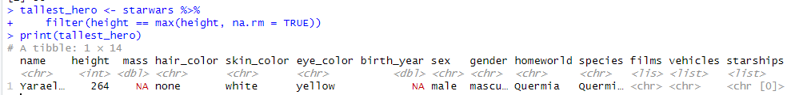
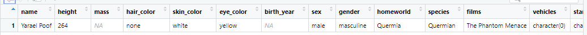

- Задание 6. Найти всех персонажей ниже 170.

```
short_hero <- starwars %>%
  filter(height < 170)
print(short_hero)
```
Присваиваем переменной short_hero результат работы функций: filter(height < 170) - aфильтруем строки датафрейма, оставляя только те значения в столбце height меньше 170 и выводим результат на экран.

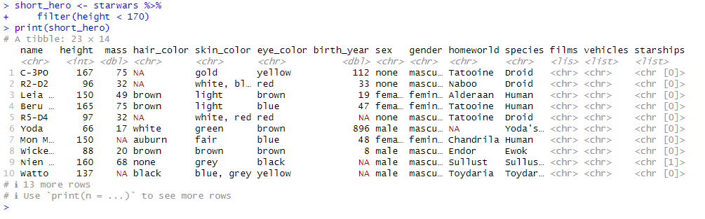
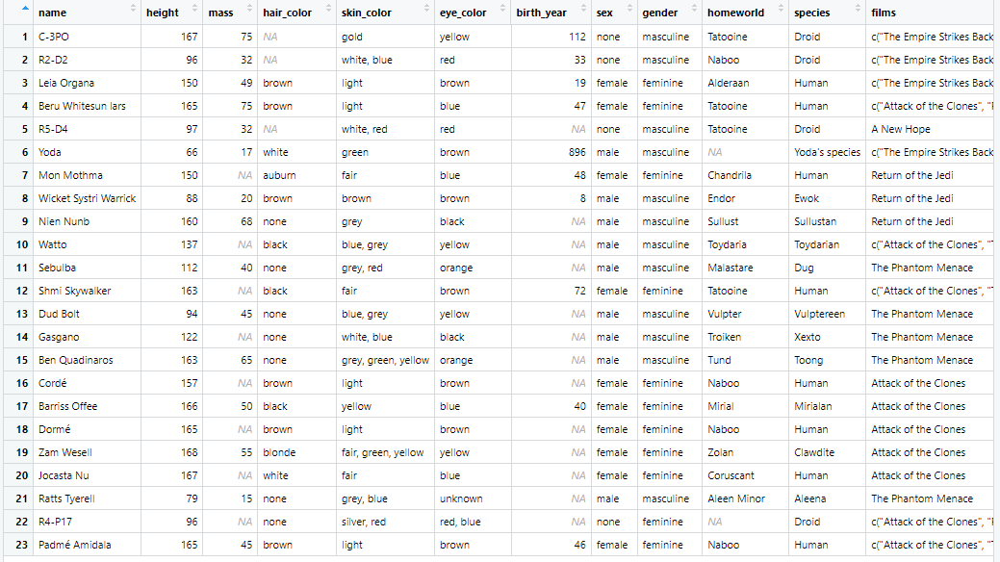

- Задание 7. Подсчитать ИМТ (индекс массы тела) для всех персонажей. ИМТ подсчитать по формуле 𝐼 = 𝑚
ℎ2 , где 𝑚
– масса (weight), а ℎ – рост (height).

```
IMT <- starwars %>%
  mutate(BMI = mass / ((height/100)^2))
print(IMT)
```
Присваиваем переменной IMT результат работы функций: mutate(BMI = mass / ((height/100)^2)) - создаем новый столбец BMI(индекс массы тела) с помощью mutate(), далее вычисляем индекс массы тела для каждого героя на основе их массы и роста и выводим результат на экран.

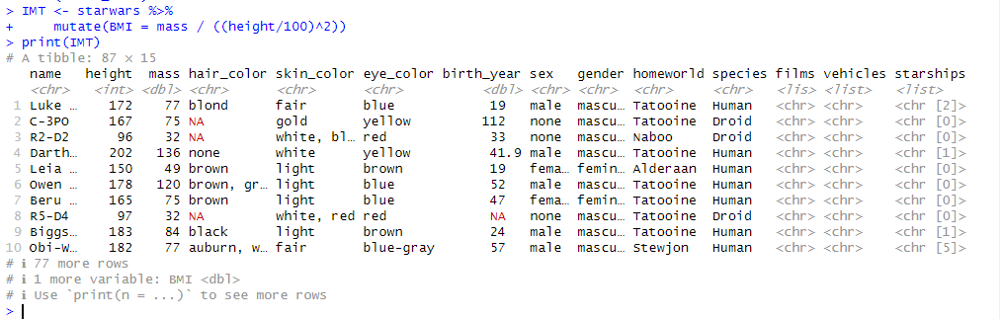
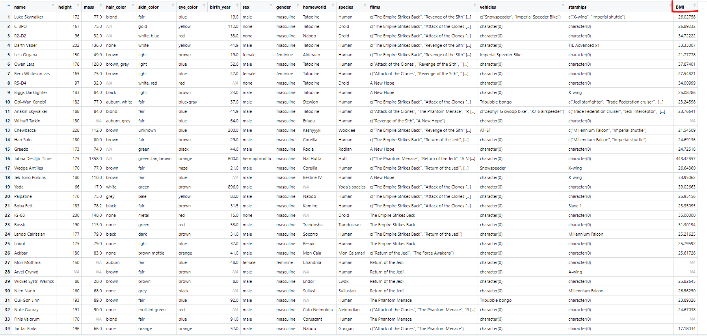

- Задание 8. Найти 10 самых “вытянутых” персонажей. “Вытянутость” оценить по отношению массы (mass) к росту
(height) персонажей.

```
ten_elongated <- starwars %>%
  mutate(elongation = mass / height) %>%
  arrange(desc(elongation)) %>%
  head(10)
print(ten_elongated)
```
Присваиваем переменной ten_elongated результат работы функций: mutate(elongation = mass / height) - создаем новый столбец в датафрейме elongation (вытянутость) и вычисляем вытянутость кажного героя, с помощью функции arrange(desc(elongation)) происходить упорядочивание таблицы по убыванию значения вытянутости, далее выбираем первые 10 строк head(10) и выводим результат на экран.

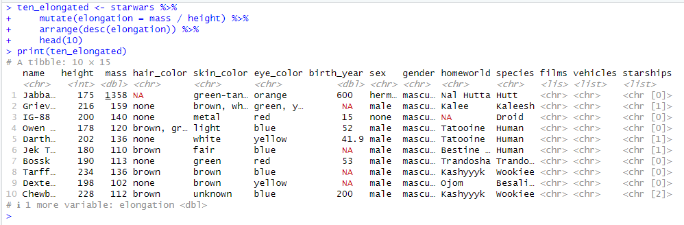
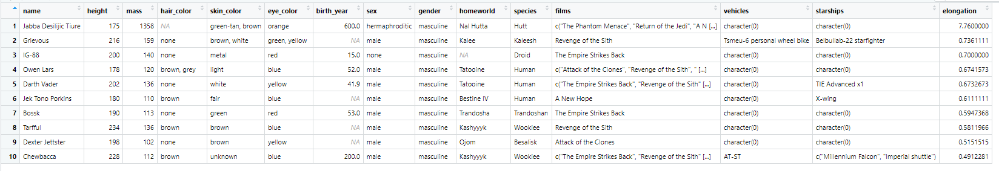

- Задание 9. Найти средний возраст персонажей каждой расы вселенной Звездных войн.

```
average_age_each_species <- starwars %>%
  group_by(species) %>%
  summarise(average_age = mean(birth_year, na.rm = TRUE))
print(average_age_each_species)
```
Присваиваем переменной average_age_each_species результат работы функций: group_by(species) - группируем данные по столбцу species, summarise(average_age = mean(birth_year, na.rm = TRUE)) - вычисляем средний возраст героев для каждого вида, используя функцию mean(), которая вычисляет среднее значение столбца birth_year, игнорируя при этом отсутствующие значения (NA) и выводим результат на экран в виде новой таблицы.

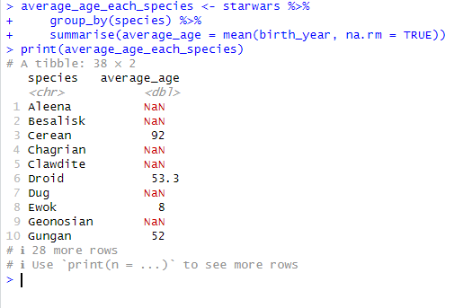


- Задание 10. Найти самый распространенный цвет глаз персонажей вселенной Звездных войн.

```
color_eyes <- starwars %>%
  count(eye_color) %>%
  filter(n == max(n))
print(color_eyes)
```
Присваиваем переменной color_eyes результат работы функций: count(eye_color) - считает кол-во записей для каждого значеия в столбце eye_color, то есть создается новая таблица, содержащая столбцы eye_color и n (кол-во записей для каждого цвета глаз), filter(n == max(n)) - фитруем данные по условию, где n равно максимальному значению в таблице и выводим результат на экран.


- Задание 11. Подсчитать среднюю длину имени в каждой расе вселенной Звездных войн.

```
average_len_name_each_species <- starwars %>%
  group_by(species) %>%
  summarise(average_name_len = mean(nchar(name)))
print(average_len_name_each_species)
```
Присваиваем переменной average_name_len_each_species результат работы функций: group_by(species) - группируем данные по значению в столбце species,  summarise(average_name_len = mean(nchar(name))) - вычисляем суммарное хначение для каждой расы, nchar(name) - вычисляет длину имени, mean() - вычисляет среднее значение и выводим результат на экран.

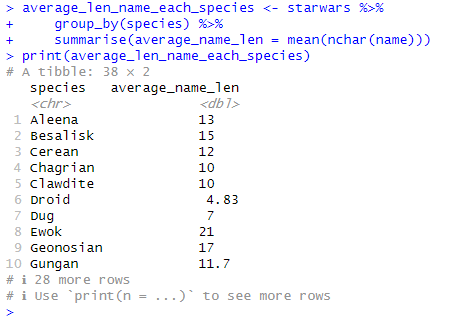
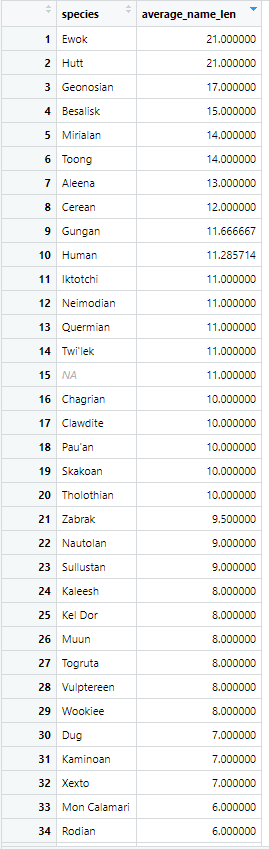

## Вывод
Развил практические навыки использования языка R для обработки данных, закрепил знания базовых типов данных в языке R и развил навыки использования функций обработки данных пакета dplyr.