## Цель работы
1. Закрепить практические навыки использования языка программирования R для обработки данных.
2. Закрепить знания основных функций обработки данных экосистемы tidyverse языка R.
3. Развить практические навыки использования функций обработки данных пакета dplyr – функции
select(), filter(), mutate(), arrange(), group_by().

## Исходные данные
1. RStudio.

## План
1. Установить пакет nycflights13.
2. Выполнить задание.
3. Оформить отчет.

## Описание шагов
1. Устанавливаем библиотеку nycflights13.

```
install.packages("nycflights13")
```
2. Загружаем пакет nycflights13 и dplyr.

```
library(nycflights13)
library(dplyr)
```
1. Переходим к выполнению заданий

- Задание 1. . Сколько встроенных в пакет nycflights13 датафреймов?

```
data(package = "nycflights13")
```


- Задание 2. Сколько строк в каждом датафрейме?

Первый способ:
```
nrow(airlines)
nrow(airports)
nrow(flights)
nrow(planes)
nrow(weather)
```


Второй способ:
```
data_list <- list(airlines, airports, flights, planes, weather)
row_data <- sapply(data_list, nrow)
cat(row_data)
```
Мы создаем список data_list, содержащий пять различных наборов данных (airlines, airports, flights, planes, weather), далее функция sapply применяется к списку для того чтобы вычислить кол-во строк в каждом датафрейме. Результат представляет собой вектор row_data, содержащий кол-во строк каждого датафрейма и выводим это на экран.

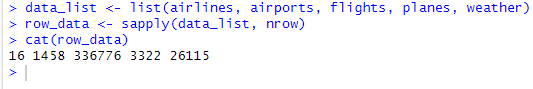

- Задание 3. Сколько столбцов в каждом датафрейме?

Первый способ:

```
ncol(airlines)
ncol(airports)
ncol(flights)
ncol(planes)
ncol(weather)
```


Второй способ:

```
data_list2 <- list(airlines, airports, flights, planes, weather)
col_data <- sapply(data_list2, ncol)
cat(col_data)
```

Мы создаем список data_list2, содержащий пять различных наборов данных (airlines, airports, flights, planes, weather), далее функция sapply применяется к списку для того чтобы вычислить кол-во столбцов в каждом датафрейме. Результат представляет собой вектор col_data, содержащий кол-во столбцов каждого датафрейма и выводим это на экран.

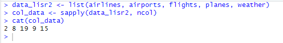

- Задание 4. Как просмотреть примерный вид датафрейма?

```
dataframe <- airlines %>% glimpse()
dataframe
dataframe2 <- airports %>% glimpse()
dataframe2
dataframe3 <- flights %>% glimpse()
dataframe3
dataframe4 <- planes %>% glimpse()
dataframe4
dataframe5 <- weather %>% glimpse()
dataframe5
```

Присваиваем переменным dataframe, dataframe2, dataframe3, dataframe4, dataframe5 результат работы функции glimpse(), которая показывает краткую информацию о структуре датафрейма(кол-во строк, столбцов и типов данных в каждом столбце), выводим результат на экран.

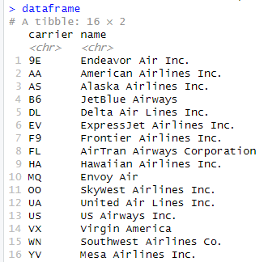
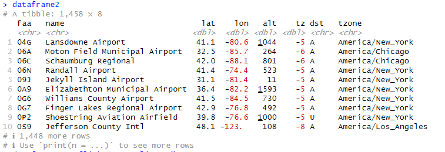

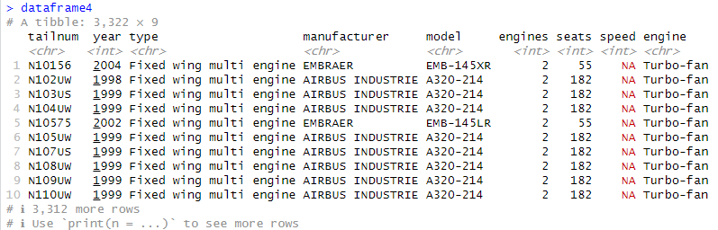
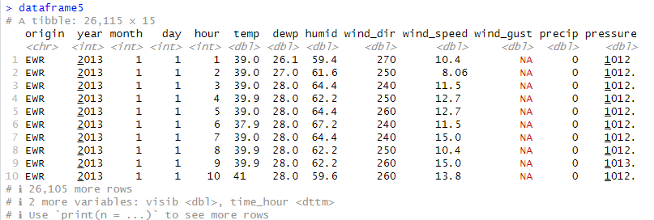

- Задание 5. Сколько компаний-перевозчиков (carrier) учитывают эти наборы данных (представлено в наборах данных)?

```
carriers <- airlines %>%
  select(carrier) %>%
  distinct() %>%
  nrow()
cat(carriers)
```

Присваиваем переменной carriers результаты работы функций: select(carrier), которая выбирает столбец carrier; distinct(), которая удаляет дубликаты значений в столбце carrier; nrow(), которая возвращает кол-во строк и выводим результат на экран.

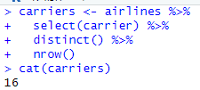

- Задание 6. Сколько рейсов принял аэропорт John F Kennedy Intl в мае?

```
flights_JFK <- flights %>%
  filter(month == 5 & dest == "JFK") %>%
  nrow()
cat(flights_JFK)
```

Присваиваем переменной flights_JFK результат работы функций: filter(month == 5 & dest == "JFK"), которая выбирает только те строки, где значение столбца month равно 5 и значение столбца dest равно JFK; nrow(), которая возвращает количество строк в наборе данных, удовлетворяющих условиям фильтрации и выводим результат на экран.

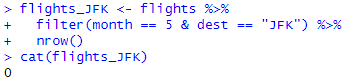

- Задание 7. Какой самый северный аэропорт?

```
N_airports <- airports %>%
  arrange(desc(lat)) %>%
  head(1)
cat(N_airports$name)
```

Присваиваем переменной N_airports значение работы функций: arrange(desc(lat)), которая сортирует строки в порядке убывания результат столбца lat (широта); head(1), которая возвращает первую строку (то есть аэропорт с наибольшей широтой) и выводим результат работы на экран.

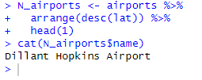

- Задание 8. Какой аэропорт самый высокогорный (находится выше всех над уровнем моря)?

```
alpine_airport <- airports %>%
  arrange(desc(alt)) %>%
  head(1)
cat(alpine_airport$name)
```

Присваиваем переменной alpine_airport результат работы функций: arrange(desc(alt)),  которая сортирует строки в порядке убывания значения столбца alt (высота над уровнем моря); head(1), которая возвращает первую строку (то есть аэропорт с наибольшей высотой над уровнем моря) и выводим на экран.

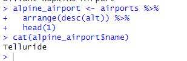

- Задание 9. Какие бортовые номера у самых старых самолетов?

```
bort_number_old_plane <- planes %>%
  arrange(year) %>%
  head(10) %>%
  select(tailnum)
bort_number_old_plane
```
Присваиваем переменной bort_number_old_plane результат работы функций: arrange(year), которая сортирует строки в порядке возвраствния значения столбца year (год выпуска самолета); head(10), которая возвращает первые 10 строк (то есть 10 самых старых самолета); select(tailnum), которая выбирает только столбец tailnum (бортовой номер) и выводим на экран.


- Задание 10. Какая средняя температура воздуха была в сентябре в аэропорту John F Kennedy Intl (в градусах Цельсия).

```
temp_sep <- weather %>%
  filter(month == 9 & origin == "JFK") %>%
  summarise(avg_temp = mean(temp, na.rm = TRUE))
grad_C <- (5/9) * (temp_sep$avg_temp - 32)
cat(grad_C)
```

Присваиваем переменной temp_sep результат работы функций: filter(month == 9 & origin == "JFK"), которая выбирает только те строки, где значение столбца month равно 9 и значение столбца origin равно "JFK" (аэропорт JFK); summarise(avg_temp = mean(temp, na.rm = TRUE)), которая вычисляет среднее значение столбца temp для выбранных строк и результат сохраняется в столбец avg_temp; присваиваем переменной grad_c значение в градусах Цельсия по формуле (5/9) * (temp_sep$avg_temp - 32), где temp_sep$avg_temp - среднее значение температуры, вычисленное на предыдущем этапе и выводим на экран.

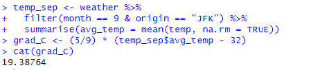

- Задание 11. Самолеты какой авиакомпании совершили больше всего вылетов в июне?

```
col_fly <- flights %>% 
  filter(month == 6) %>% 
  group_by(carrier) %>% 
  summarize(num_flights = n()) %>% 
  arrange(desc(num_flights)) %>% 
  head(1)
col_fly
```

Присваиваем переменной col_fly результат работы функций: filter(month == 6), которая выбирает те строки, где month = 6; group_by(carrier), которая группирует строки по значению столбца carrier; summarize(num_flights = n()), которая вычисляет кол-во строк в каждой группе и результат сохраняем в столбец num_flights; arrange(desc(num_flights)), которая сортирует строки в порядке убывания по значению столбца num_flights; head(1), которая возвращает первую строку (т.е. авиакомпанию с наибольшим кол-во рейсов в июне) и выводим на экран.


- Задание 12. Самолеты какой авиакомпании задерживались чаще других в 2013 году?

```
flight_delays <- flights %>% 
  filter(year == 2013) %>% 
  group_by(carrier) %>% 
  summarize(num_delays = sum(arr_delay > 0, na.rm = TRUE)) %>% 
  arrange(desc(num_delays)) %>% 
  head(1)
flight_delays
```

Присваиваем переменной flight_delays результат работы функций: filter(year == 2013), котрая выбирает те строки, где year = 2013; group_by(carrier), которая группирует строки по значению carrier; summarize(num_delays = sum(arr_delay > 0, na.rm = TRUE)), которая вычисляет кол-во строк в каждой группе, где значение столбца arr_delay больше 0 (т.е. количество задержек прибытия рейсов для каждой авиакомпании в 2013 году), функция na.rm = TRUE используется для игнорирования пропущенных значений; arrange(desc(num_delays)), которая сортирует строки по убыванию значения столбца num_delays; head(1), которая возвращает первую строку (т.е. авиакомпанию с наибольшим количеством задержек прибытия рейсов в 2013 году) и выводим на экран.


## Вывод
Развил практические навыки использования языка R для обработки данных, закрепил знания базовых типов данных в языке R и развил навыки использования функций обработки данных пакета dplyr и nycflights13.
